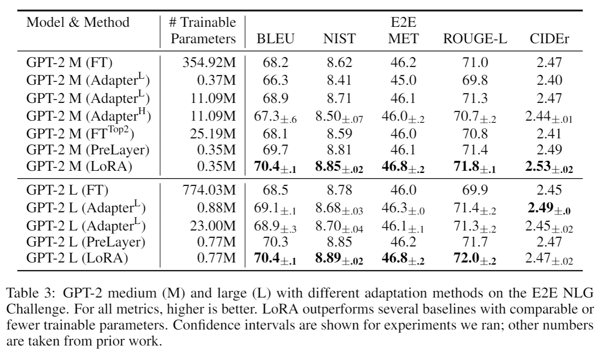

# Adapting GPT-2 using LoRA

This folder contains the implementation of LoRA in GPT-2 using the Python package `lora` and steps to replicate the results in our recent paper

**LoRA: Low-Rank Adaptation of Large Language Models** <br>
*Edward J. Hu\*, Yelong Shen\*, Phillip Wallis, Zeyuan Allen-Zhu, Yuanzhi Li, Shean Wang, Lu Wang, Weizhu Chen* <br>
Paper: https://arxiv.org/abs/2106.09685 <br>

<p>

</p>

This repo reproduces our experiments on GPT-2.

## Repository Overview

Our implementation is based on the fine-tuning code for GPT-2 in [Hugging Face](https://huggingface.co/).
There are several directories in this repo:
* [src/](src) contains the source code used for data processing, training, and decoding.
* [eval/](eval) contains the code for task-specific evaluation scripts.
* [data/](data) contains the raw data we used in our experiments.
* [vocab/](vocab) contains the GPT-2 vocabulary files.

## Getting Started

 1. You can start with the following docker image: `nvcr.io/nvidia/pytorch:20.03-py3` on a GPU-capable machine, but any generic PyTorch image should work.
 ```
 docker run -it nvcr.io/nvidia/pytorch:20.03-py3
 ```

 2. Clone the repo and install dependencies in a virtual environment (remove sudo if running in docker container):
 ```
 sudo apt-get update
 sudo apt-get -y install git jq virtualenv
 git clone https://github.com/microsoft/LoRA.git; cd LoRA
 virtualenv -p `which python3` ./venv
 . ./venv/bin/activate
 pip install -r requirement.txt
 bash download_pretrained_checkpoints.sh
 bash create_datasets.sh
 cd ./eval
 bash download_evalscript.sh
 cd ..
 ```

#### Now we are ready to replicate the results in our paper.

## Replicating Our Result on E2E

1. Train GPT-2 Medium with LoRA (see our paper for hyperparameters for GPT-2 Medium)
```
python -m torch.distributed.launch --nproc_per_node=1 src/gpt2_ft.py \
    --train_data ./data/e2e/train.jsonl \
    --valid_data ./data/e2e/valid.jsonl \
    --train_batch_size 8 \
    --grad_acc 1 \
    --valid_batch_size 4 \
    --seq_len 512 \
    --model_card gpt2.md \
    --init_checkpoint ./pretrained_checkpoints/gpt2-medium-pytorch_model.bin \
    --platform local \
    --clip 0.0 \
    --lr 0.0002 \
    --weight_decay 0.01 \
    --correct_bias \
    --adam_beta2 0.999 \
    --scheduler linear \
    --warmup_step 500 \
    --max_epoch 5 \
    --save_interval 1000 \
    --lora_dim 4 \
    --lora_alpha 32 \
    --lora_dropout 0.1 \
    --label_smooth 0.1 \
    --work_dir ./trained_models/GPT2_M/e2e \
    --random_seed 110
```

2. Generate outputs from the trained model using beam search:
```
python -m torch.distributed.launch --nproc_per_node=1 src/gpt2_beam.py \
    --data ./data/e2e/test.jsonl \
    --batch_size 1 \
    --seq_len 512 \
    --eval_len 64 \
    --model_card gpt2.md \
    --init_checkpoint ./trained_models/GPT2_M/e2e/model.26289.pt \
    --platform local \
    --lora_dim 4 \
    --lora_alpha 32 \
    --beam 10 \
    --length_penalty 0.8 \
    --no_repeat_ngram_size 4 \
    --repetition_penalty 1.0 \
    --eos_token_id 628 \
    --work_dir ./trained_models/GPT2_M/e2e \
    --output_file predict.26289.b10p08r4.jsonl
```

3. Decode outputs from step (2)
```
python src/gpt2_decode.py \
    --vocab ./vocab \
    --sample_file ./trained_models/GPT2_M/e2e/predict.26289.b10p08r4.jsonl \
    --input_file ./data/e2e/test_formatted.jsonl \
    --output_ref_file e2e_ref.txt \
    --output_pred_file e2e_pred.txt
```

4. Run evaluation on E2E test set

```
python eval/e2e/measure_scores.py e2e_ref.txt e2e_pred.txt -p
```

## Replicating Our Result on WebNLG

1. Follow steps 1 and 2 from E2E pipeline by replacing references to E2E with webnlg (see our paper for hyperparameters)

2. Decode outputs from beam search (step 2 above)
```
python src/gpt2_decode.py \
    --vocab ./vocab \
    --sample_file ./trained_models/GPT2_M/webnlg/predict.20000.b10p08.jsonl \
    --input_file ./data/webnlg_challenge_2017/test_formatted.jsonl \
    --ref_type webnlg \
    --ref_num 6 \
    --output_ref_file eval/GenerationEval/data/references_webnlg \
    --output_pred_file eval/GenerationEval/data/hypothesis_webnlg \
    --tokenize --lower
```

3. Run evaluation on WebNLG test set
```
cd ./eval/GenerationEval/
python eval.py \
    -R data/references_webnlg/reference \
    -H data/hypothesis_webnlg \
    -nr 6 \
    -m bleu,meteor,ter 
cd ../..
```

## Replicating Our Result on DART

1. Follow steps 1 and 2 from E2E pipeline by replacing references to E2E with dart (see our paper for hyperparameters)

2. Decode outputs from beam search (step 2 above)
```
python src/gpt2_decode.py \
        --vocab ./vocab \
        --sample_file ./trained_models/GPT2_M/dart/predict.20000.b10p08.jsonl \
        --input_file ./data/dart/test_formatted.jsonl \
        --ref_type dart \
        --ref_num 6 \
        --output_ref_file eval/GenerationEval/data/references_dart \
        --output_pred_file eval/GenerationEval/data/hypothesis_dart \
        --tokenize --lower
```

3. Run evaluation on Dart test set
```
cd ./eval/GenerationEval/
python eval.py \
    -R data/references_dart/reference \
    -H data/hypothesis_dart \
    -nr 6 \
    -m bleu,meteor,ter 
cd ../..
```

## Citation
```
@misc{hu2021lora,
    title={LoRA: Low-Rank Adaptation of Large Language Models},
    author={Hu, Edward and Shen, Yelong and Wallis, Phil and Allen-Zhu, Zeyuan and Li, Yuanzhi and Wang, Lu and Chen, Weizhu},
    year={2021},
    eprint={2106.09685},
    archivePrefix={arXiv},
    primaryClass={cs.CL}
}
```