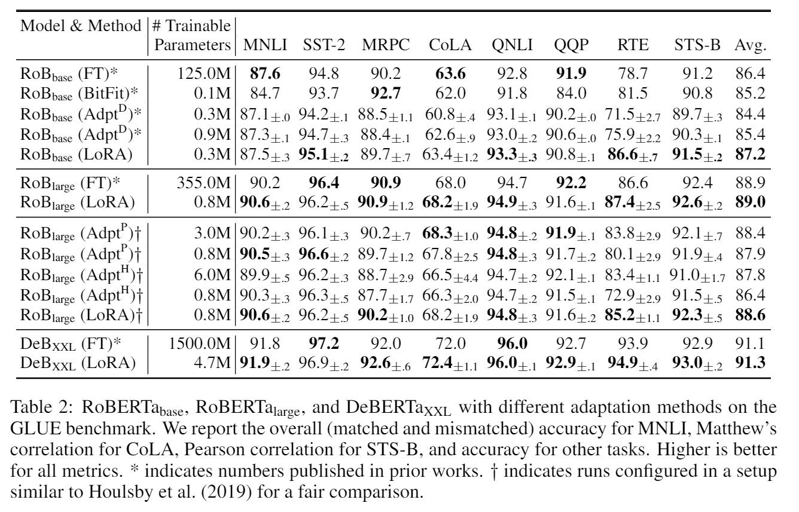
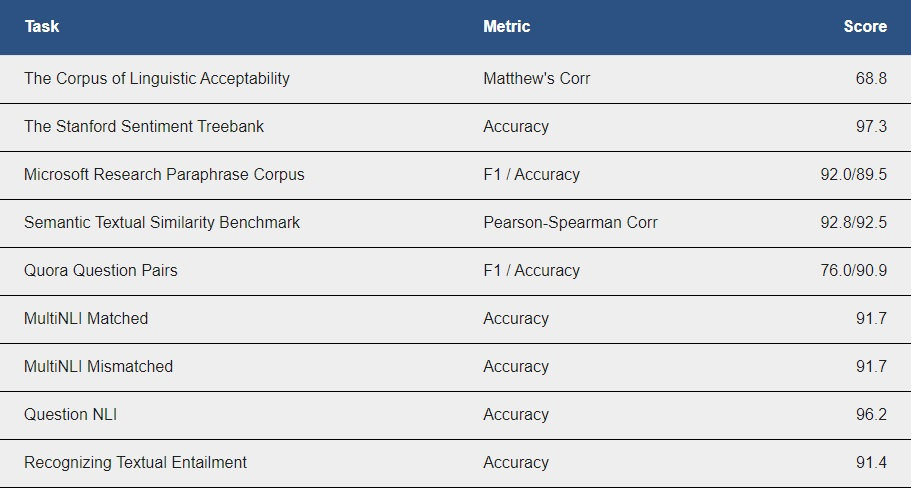

# Adapting RoBERTa and DeBERTa V2 using LoRA

This folder contains the implementation of LoRA in RoBERTa and DeBERTa V2 using the Python package `lora`. LoRA is described in the following pre-print:

**LoRA: Low-Rank Adaptation of Large Language Models** <br>
*Edward J. Hu\*, Yelong Shen\*, Phillip Wallis, Zeyuan Allen-Zhu, Yuanzhi Li, Shean Wang, Lu Wang, Weizhu Chen* <br>
Paper: https://arxiv.org/abs/2106.09685 <br>

## Adapting to the GLUE Benchmark
Our experiments on the GLUE benchmark are run on 4 NVIDIA Tesla V100 GPU cards out of a DGX-1. The results may vary due to different GPU models, drivers, CUDA SDK versions, floating-point precisions, and random seeds. 
We report below the dev set results, taking the medium over 5 runs:

<p>

</p>

Here are the GLUE benchmark test set results for DeBERTa XXL 1.5B (no ensemble):

<p>

</p>

## Download LoRA checkpoints

|   | Dataset  | RoBERTa base 125M <br> LoRA - 0.3 M  | RoBERTa large 355M <br> LoRA - 0.8 M  | DeBERTa XXL 1.5B <br> LoRA - 4.7 M |
|---|----------|--------------------|----------------------|------------------|
|   | MNLI     |[3.4 MB](https://github.com/msft-edward/LoRA_private/releases/download/RoBERTa-base/roberta_base_lora_mnli.bin) |[7.1 MB](https://github.com/msft-edward/LoRA_private/releases/download/RoBERTa-large/roberta_large_lora_mnli.bin) |[27.1 MB](https://github.com/msft-edward/LoRA_private/releases/download/DeBERTa/deberta_v2_xxlarge_lora_mnli.bin) |
|   | SST2     |[3.4 MB](https://github.com/msft-edward/LoRA_private/releases/download/RoBERTa-base/roberta_base_lora_sst2.bin)  |[7.1 MB](https://github.com/msft-edward/LoRA_private/releases/download/RoBERTa-large/roberta_large_lora_sst2.bin)  |[27.1 MB](https://github.com/msft-edward/LoRA_private/releases/download/DeBERTa/deberta_v2_xxlarge_lora_mnli.bin)  |
|   | MRPC     |[3.4 MB](https://github.com/msft-edward/LoRA_private/releases/download/RoBERTa-base/roberta_base_lora_mrpc.bin)  |[7.1 MB](https://github.com/msft-edward/LoRA_private/releases/download/RoBERTa-large/roberta_large_lora_mrpc.bin)  |[27.1 MB](https://github.com/msft-edward/LoRA_private/releases/download/DeBERTa/deberta_v2_xxlarge_lora_mnli.bin)  |
|   | CoLA     |[3.4 MB](https://github.com/msft-edward/LoRA_private/releases/download/RoBERTa-base/roberta_base_lora_cola.bin)  |[7.1 MB](https://github.com/msft-edward/LoRA_private/releases/download/RoBERTa-large/roberta_large_lora_cola.bin)  |[27.1 MB](https://github.com/msft-edward/LoRA_private/releases/download/DeBERTa/deberta_v2_xxlarge_lora_mnli.bin)  |
|   | QNLI     |[3.4 MB](https://github.com/msft-edward/LoRA_private/releases/download/RoBERTa-base/roberta_base_lora_qnli.bin)  |[7.1 MB](https://github.com/msft-edward/LoRA_private/releases/download/RoBERTa-large/roberta_large_lora_qnli.bin)  |[27.1 MB](https://github.com/msft-edward/LoRA_private/releases/download/DeBERTa/deberta_v2_xxlarge_lora_mnli.bin)  |
|   | QQP      |[3.4 MB](https://github.com/msft-edward/LoRA_private/releases/download/RoBERTa-base/roberta_base_lora_qqp.bin)  |[7.1 MB](https://github.com/msft-edward/LoRA_private/releases/download/RoBERTa-large/roberta_large_lora_qqp.bin)  |[27.1 MB](https://github.com/msft-edward/LoRA_private/releases/download/DeBERTa/deberta_v2_xxlarge_lora_mnli.bin)  |
|   | RTE      |[3.4 MB](https://github.com/msft-edward/LoRA_private/releases/download/RoBERTa-base/roberta_base_lora_rte.bin)  |[7.1 MB](https://github.com/msft-edward/LoRA_private/releases/download/RoBERTa-large/roberta_large_lora_rte.bin)  |[27.1 MB](https://github.com/msft-edward/LoRA_private/releases/download/DeBERTa/deberta_v2_xxlarge_lora_mnli.bin)  |
|   | STSB     |[3.4 MB](https://github.com/msft-edward/LoRA_private/releases/download/RoBERTa-base/roberta_base_lora_stsb.bin)  |[7.1 MB](https://github.com/msft-edward/LoRA_private/releases/download/RoBERTa-large/roberta_large_lora_stsb.bin)  |[27.1 MB](https://github.com/msft-edward/LoRA_private/releases/download/DeBERTa/deberta_v2_xxlarge_lora_mnli.bin)  |

## Steps to reproduce our results
### Create and activate conda env
```console
conda env create -f environment.yml
```
### Install the pre-requisites
lora:
```console
pip install -e ..
```
NLU:
```console
pip install -e .
```
### Start the experiments
```console
deberta_v2_xxlarge_mnli.sh
deberta_v2_xxlarge_sst2.sh
deberta_v2_xxlarge_mrpc.sh
deberta_v2_xxlarge_cola.sh
deberta_v2_xxlarge_qnli.sh
deberta_v2_xxlarge_qqp.sh
deberta_v2_xxlarge_rte.sh
deberta_v2_xxlarge_stsb.sh
```
For MRPC, RTE, and STSB, you need to download and start from the LoRA-adapted MNLI checkpoint and change the path accordingly in the shell script.

Attention: xxlarge-mnli is the LoRA-adapted model from our first MNLI experiments, instead of https://huggingface.co/microsoft/deberta-v2-xxlarge-mnli.

We also provide the shell scripts for roberta-base and roberta-large ( {roberta_large|roberta_base}_{task name}.sh ).

### Evaluate the checkpoints
```console
python -m torch.distributed.launch --nproc_per_node=1 examples/text-classification/run_glue.py \
--model_name_or_path microsoft/deberta-v2-xxlarge \
--lora_path ./deberta_v2_xxlarge_lora_mnli.bin \
--task_name mnli \
--do_eval \
--output_dir ./output \
--apply_lora \
--lora_r 16 \
--lora_alpha 32
```

### Enable Cutoff/R-drop for data augmentation
```console
mnli.cutoff.sh
mnli.rdrop.sh
```

## Citation
```
@misc{hu2021lora,
    title={LoRA: Low-Rank Adaptation of Large Language Models},
    author={Hu, Edward and Shen, Yelong and Wallis, Phil and Allen-Zhu, Zeyuan and Li, Yuanzhi and Wang, Lu and Chen, Weizhu},
    year={2021},
    eprint={2106.09685},
    archivePrefix={arXiv},
    primaryClass={cs.CL}
}
```
